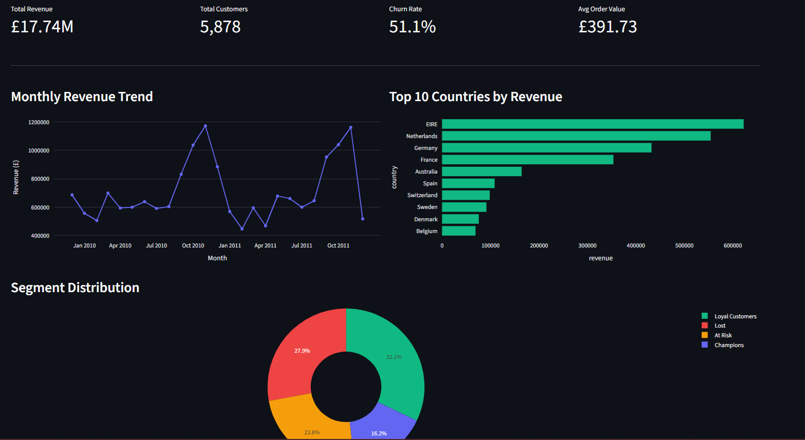
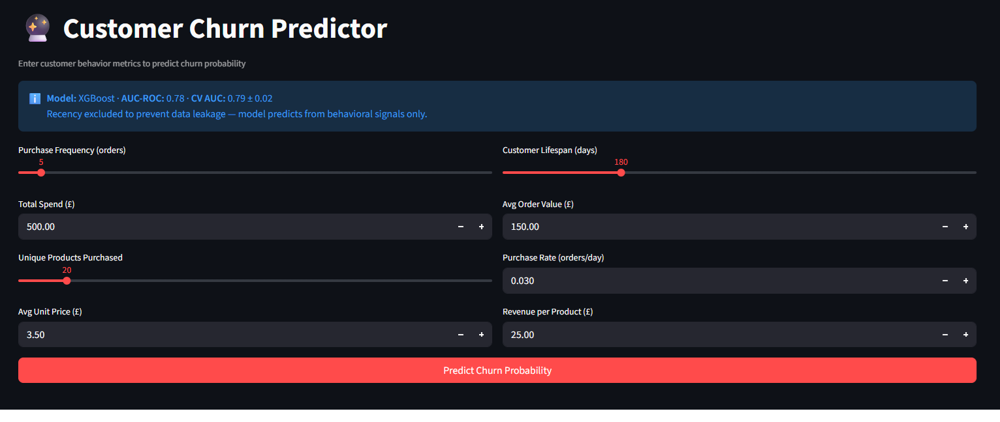
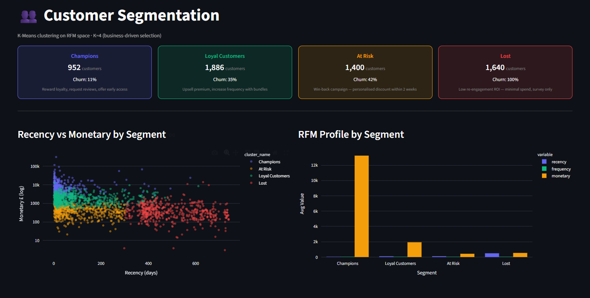
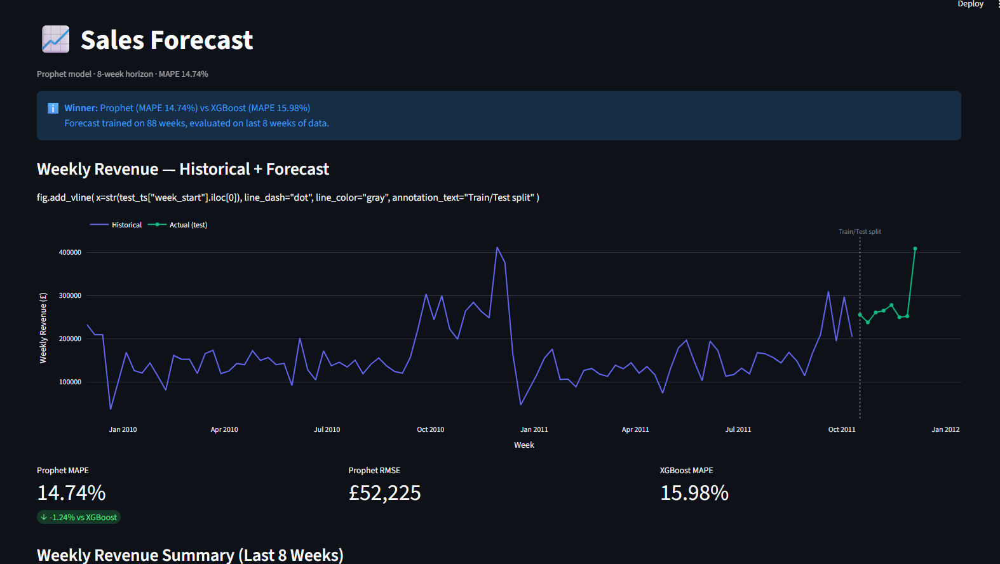

# 📦 RetailPulse

> End-to-end retail analytics platform — predicting customer churn, forecasting weekly sales, and segmenting customers into actionable tiers using 1M+ real transactions.


🚀 **🚧 Streamlit deployment in progress** · 📊 **[LinkedIn →](https://www.linkedin.com/in/aagamjainn-)**

---

## Real Business Problems This Solves

Most retail businesses lose 20–30% of customers every year without knowing *who* is about to leave, *why*, or *when*. RetailPulse solves three concrete problems:

**1. Who is about to churn?**
Without a churn model, retention teams send the same discount to all 5,878 customers — wasting budget on people who would have bought anyway. RetailPulse scores every customer with a churn probability, so marketing can target the 1,400 "At Risk" customers specifically, not the 952 Champions who are already loyal.

**2. How much revenue will we make next month?**
Inventory planning, staffing, and ad budgets all depend on revenue forecasts. RetailPulse forecasts weekly revenue 8 weeks ahead (MAPE 14.74%), giving operations teams a data-driven planning horizon instead of gut feel.

**3. Which customers deserve which treatment?**
Sending a win-back discount to a Champion is wasteful. Sending a loyalty reward to a Lost customer is pointless. The segmentation engine puts every customer into one of four tiers with a specific recommended action — reducing marketing waste and improving ROI.

---

## Results

| Model | Metric | Score |
|---|---|---|
| XGBoost Churn Classifier | AUC-ROC | **0.78** |
| XGBoost Churn Classifier | 5-fold CV AUC | **0.79 ± 0.02** |
| Prophet Sales Forecast | MAPE (8-week horizon) | **14.74%** |
| K-Means Segmentation | Silhouette Score | **0.36 (K=4)** |

**Key findings from the data:**
- 51.1% of customers churned (no purchase in 90 days) — a significant retention opportunity
- Champions (22% of base) generate avg £13,250 revenue vs £430 for At Risk — 30× difference
- Lost segment shows 100% churn rate, independently confirmed by both supervised and unsupervised models
- Peak revenue window: 10am–2pm on weekdays; Sunday is the lowest revenue day

---

## Dashboard Screenshots

### Overview — KPIs, Revenue Trend, Segment Distribution


### Churn Predictor — Live probability gauge + recommended action


### Customer Segments — RFM scatter + segment profiles


### Sales Forecast — Prophet vs XGBoost 8-week comparison


> 📸 **To add screenshots:** create `assets/screenshots/` folder, take screenshots of each Streamlit page, save as the filenames above, then `git add assets/ && git commit -m "feat: add dashboard screenshots"`

---

## Challenges Faced & How I Solved Them

These are real problems encountered during the build — not textbook exercises.

**1. Data leakage giving AUC = 1.0**
The first churn model scored perfect AUC. The cause: `recency` (days since last purchase) was included as a feature, but churn is *defined* as recency ≥ 90 days — so the model was essentially reading the label. Caught this, removed recency entirely, rebuilt with 8 behavioral-only features. AUC dropped to 0.78 — realistic and defensible.

**2. K-Means returning only 2 clusters**
Silhouette score peaked at K=2, giving "Champions vs Everyone Else" — no business utility. Overrode the statistical optimum with K=4 based on business interpretability. The slight silhouette drop (0.42 → 0.36) is justified: four segments map directly to four distinct marketing actions.

**3. Handling 243K rows with missing customer IDs**
The raw dataset had 243,007 rows (23%) with no customer ID — impossible to compute RFM without it. Decision: drop them. Documented with exact counts in the ETL script so the cleaning rationale is reproducible and explainable.

**4. Plotly `add_vline` bug with pandas Timestamps**
`fig.add_vline()` threw a TypeError with datetime x-axis values on the installed plotly version. Replaced with `add_shape()` + `add_annotation()` as a reliable workaround — a real debugging decision, not a tutorial fix.

**5. CSV vs Excel loading on a 1M-row dataset**
Original implementation used `pd.read_excel()` with two sheets. Switched to CSV with `encoding="ISO-8859-1"` after hitting encoding errors on Windows. Load time dropped significantly and the pipeline became more portable.

---

## Pipeline

```
Raw CSV (1,067,371 rows)
    │
    ▼
1. ETL + MySQL             → 5,878 customers · 36,969 invoices · 805K clean rows
    │
    ▼
2. SQL Business Queries    → 10 queries: revenue trends, cohort retention, RFM base
   + EDA                   → 10 charts: seasonality, frequency dist, YoY comparison
    │
    ▼
3. Feature Engineering     → RFM scores · churn label (90-day) · lag + rolling features
    │
    ▼
4. Modeling
   ├── Churn Prediction     → XGBoost AUC 0.78 + SHAP explainability (no leakage)
   ├── Sales Forecast       → Prophet MAPE 14.74% vs XGBoost 15.98%
   └── Segmentation         → K-Means K=4: Champions · Loyal · At Risk · Lost
    │
    ▼
5. Streamlit Dashboard     → 4-page live interactive app
```

---

## Tech Stack

| Layer | Tools |
|---|---|
| Database | MySQL · SQLAlchemy |
| Data Processing | Python · pandas · numpy |
| Machine Learning | XGBoost · scikit-learn · Prophet · SHAP · joblib |
| Visualisation | matplotlib · seaborn · plotly |
| Dashboard | Streamlit |

---

## Project Structure

```
retailpulse/
│
├── src/                              # pipeline scripts
│   ├── etl_load.py                   # ingest CSV → MySQL
│   ├── eda.py                        # EDA charts
│   ├── feature_engineering.py        # RFM + churn label + lag features
│   ├── fix_churn.py                  # churn model (leakage-free)
│   ├── fix_segmentation.py           # K=4 segmentation
│   └── model_forecast.py             # Prophet + XGBoost forecasting
│
├── sql/
│   ├── schema.sql                    # MySQL DDL
│   └── business_queries.sql          # 10 business SQL queries
│
├── data/                             # generated CSVs (raw CSV excluded)
│   ├── rfm_features.csv
│   ├── rfm_with_clusters.csv
│   └── timeseries_weekly.csv
│
├── models/                           # trained model pkl files
├── outputs/charts/                   # generated EDA charts
├── assets/screenshots/               # dashboard screenshots for README
│
├── app.py                            # Streamlit dashboard (4 pages)
├── requirements.txt
├── .gitignore
└── README.md
```

---

## Quickstart

```bash
git clone https://github.com/aagamjn/retailpulse
cd retailpulse
pip install -r requirements.txt
```

Create `.env` at root:
```
DB_USER=root
DB_PASSWORD=yourpassword
DB_HOST=localhost
DB_NAME=retailpulse
```

Download dataset → [Online Retail II on Kaggle](https://www.kaggle.com/datasets/mashlyn/online-retail-ii-uci) → place at `data/online_retail_II.csv`

Run pipeline in order:
```bash
python src/etl_load.py
python src/eda.py
python src/feature_engineering.py
python src/fix_churn.py
python src/model_forecast.py
python src/fix_segmentation.py
streamlit run app.py
```

---

## Key Design Decisions

**Why remove recency from churn features?**
Recency directly encodes the churn label — including it gives AUC=1.0 (data leakage). The model predicts from behavioral signals only: purchase frequency, monetary value, lifespan, product variety, order value, and purchase rate.

**Why K=4 when silhouette peaked at K=2?**
K=2 gives "Champions vs Everyone Else" — not actionable. K=4 maps to four distinct marketing strategies. The silhouette drop from 0.42 to 0.36 is the cost of business interpretability.

**Why Prophet over XGBoost for forecasting?**
Prophet won on MAPE (14.74% vs 15.98%) and handles yearly seasonality natively without manual lag engineering. XGBoost is retained as a comparison baseline.

---

## Dataset

[Online Retail II — UCI Machine Learning Repository](https://archive.ics.uci.edu/dataset/502/online+retail+ii)
Chen, D., Sain, S.L., & Guo, K. (2012). Data mining for the online retail industry.
*Journal of Database Marketing and Customer Strategy Management*, 19(3), 197–208.

---

## Author

**Aagam Jain** · B.Tech ECE · SVNIT Surat  
[GitHub](https://github.com/aagamjn) · [LinkedIn](https://www.linkedin.com/in/aagamjainn-)